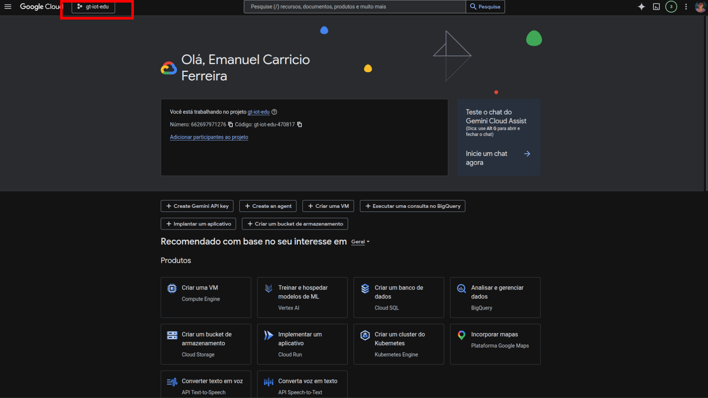
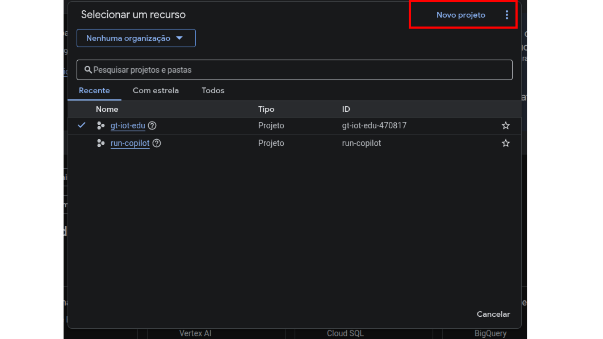
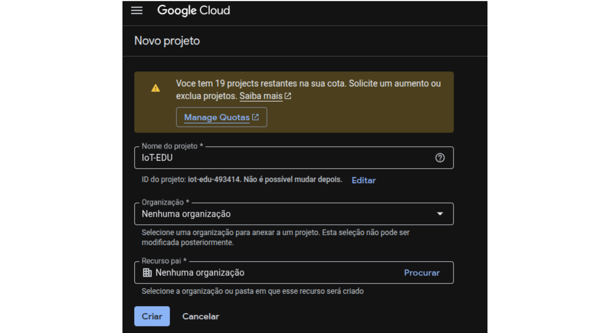
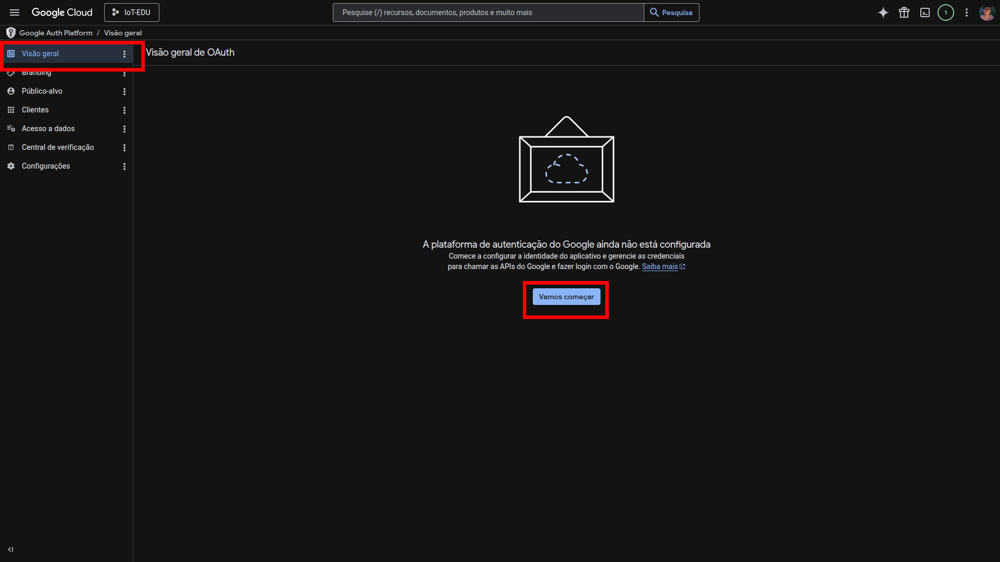
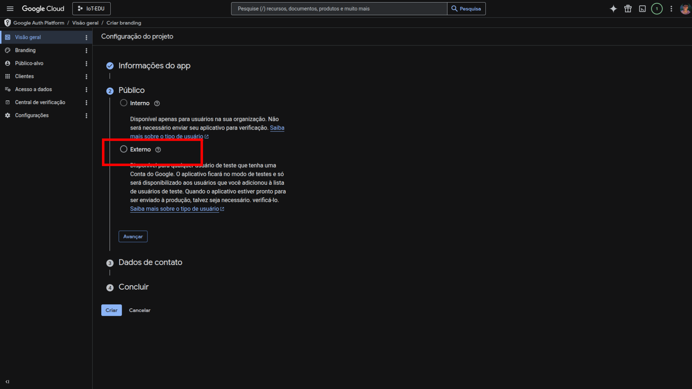
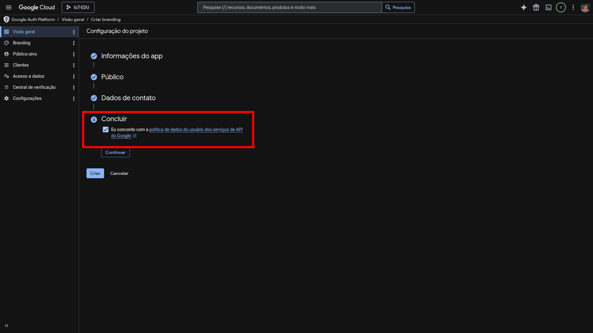
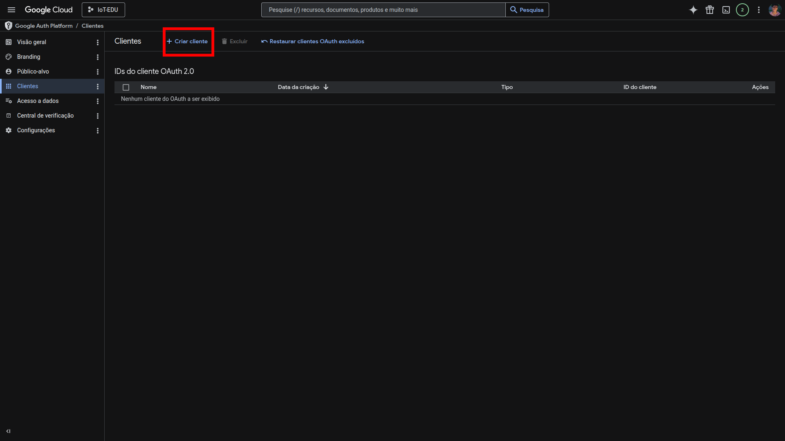
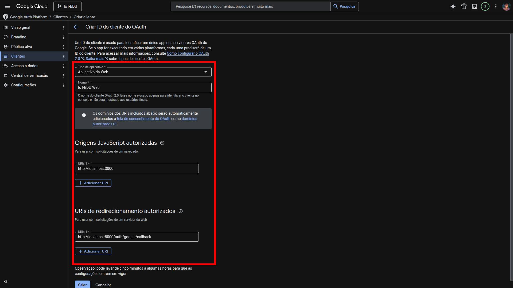
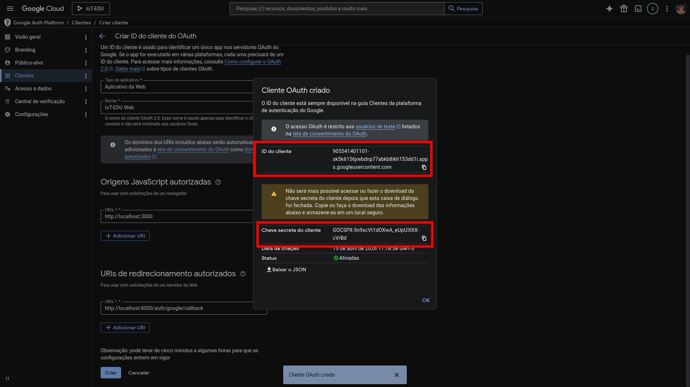

### 1.1. Obter Credenciais do Google OAuth

Para que o login via Google funcione, é necessário criar um projeto no Google Cloud e gerar um **Client ID** e um **Client Secret**. Siga os passos abaixo:

---

#### 1.1.1. Acesse o Google Cloud Console
Acesse [console.cloud.google.com](https://console.cloud.google.com) e faça login com sua conta Google.

#### 1.1.2. Crie um novo projeto
* Clique no seletor de projetos no topo da página.
* Clique em **"Novo Projeto"**, dê um nome (ex: `IoT-EDU`) e clique em **"Criar"**.
* Aguarde e certifique-se de que o novo projeto está selecionado no canto superior esquerdo.

> ⚠️ **Atenção:** Confira no canto superior esquerdo o projeto atual.

#### 1.1.3. Configure a Tela de Consentimento OAuth
* No menu lateral, vá em **"APIs e Serviços" → "Tela de permissão OAuth"**.
* Preencha os campos obrigatórios:
    * **Nome do app:** IoT-EDU (ou qualquer nome)
    * **Definir Email:** seu e-mail
* Selecione o tipo **"Externo"** e clique em **"Criar"**.
* Clique em **"Salvar e continuar"** até finalizar (as demais etapas podem ficar vazias para ambiente de teste).

#### 1.1.4. Crie as Credenciais OAuth
* Vá em **"APIs e Serviços" → "Credenciais"**.
* Clique em **"+ Criar Credenciais" → "ID do cliente OAuth"**.
* Em **"Tipo de aplicativo"**, selecione **"Aplicativo da Web"**.
* Dê um nome (ex: `IoT-EDU Web`).
* Em **"Origens JavaScript autorizadas"**, adicione:
    `http://localhost:3000`
* Em **"URIs de redirecionamento autorizados"**, adicione:
    `http://localhost:8000/api/auth/google/callback`
* Clique em **"Criar"**.

#### 1.1.5. Copie as credenciais
Uma janela exibirá seu **Client ID** e **Client Secret**. Guarde esses valores — eles serão usados no passo seguinte.

> ⚠️ **Atenção:** Nunca versione o `Client Secret` nem o compartilhe publicamente.
