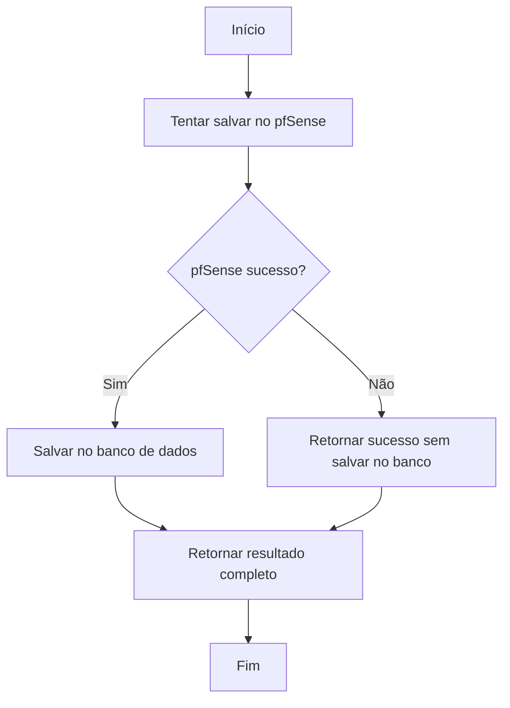

# 🔄 Guia: Lógica de Rollback do Endpoint /dhcp/save

## 📋 Visão Geral

O endpoint `POST /api/devices/dhcp/save` foi atualizado para implementar uma lógica de **rollback automático** que garante consistência entre o pfSense e o banco de dados local.

## 🎯 Problema Resolvido

### ❌ **Antes (Problema)**
```json
{
  "status": "success",
  "servers_saved": 1,
  "mappings_saved": 1,
  "mappings_updated": 0,
  "timestamp": "2025-09-02T18:04:33.932473",
  "pfsense_saved": false,
  "pfsense_message": "Erro ao salvar no pfSense: 400 Client Error: Bad Request"
}
```

**Problema**: Dados salvos no banco mesmo com falha no pfSense, causando inconsistência.

### ✅ **Agora (Solução)**
```json
{
  "status": "success",
  "servers_saved": 0,
  "mappings_saved": 0,
  "mappings_updated": 0,
  "timestamp": "2025-09-02T18:04:33.932473",
  "pfsense_saved": false,
  "pfsense_message": "Erro ao salvar no pfSense: 400 Client Error: Bad Request"
}
```

**Solução**: Nenhum dado salvo no banco quando pfSense falha.

## 🔧 Lógica Implementada

### 📊 **Fluxo de Execução**



### 🔍 **Detalhamento da Lógica**

#### 1. **Tentativa no pfSense Primeiro**
```python
# Primeiro, tentar salvar no pfSense
pfsense_success = False
pfsense_message = ""

try:
    pfsense_result = cadastrar_mapeamento_statico_dhcp_pfsense(pfsense_data)
    pfsense_success = True
    pfsense_message = "Dados salvos no pfSense com sucesso"
except Exception as e:
    pfsense_success = False
    pfsense_message = f"Erro ao salvar no pfSense: {e}"
```

#### 2. **Decisão Condicional para Banco**
```python
# Só salvar no banco de dados se o pfSense foi bem-sucedido
if pfsense_success:
    # Salvar no banco de dados
    with DhcpService() as dhcp_service:
        result = dhcp_service.save_dhcp_data(dhcp_data)
else:
    # Se falhou no pfSense, não salvar no banco
    result = {
        'status': 'success',
        'servers_saved': 0,
        'mappings_saved': 0,
        'mappings_updated': 0,
        'timestamp': datetime.now().isoformat()
    }
```

## 📊 **Cenários de Resposta**

### ✅ **Cenário 1: Sucesso Completo**
```json
{
  "status": "success",
  "servers_saved": 1,
  "mappings_saved": 1,
  "mappings_updated": 0,
  "timestamp": "2025-09-02T18:04:33.932473",
  "pfsense_saved": true,
  "pfsense_message": "Dados salvos no pfSense com sucesso"
}
```

**O que aconteceu:**
- ✅ pfSense salvou com sucesso
- ✅ Banco de dados salvou com sucesso
- ✅ Dados consistentes entre sistemas

### ⚠️ **Cenário 2: Falha no pfSense**
```json
{
  "status": "success",
  "servers_saved": 0,
  "mappings_saved": 0,
  "mappings_updated": 0,
  "timestamp": "2025-09-02T18:04:33.932473",
  "pfsense_saved": false,
  "pfsense_message": "Erro ao salvar no pfSense: 400 Client Error: Bad Request for url: https://iotedu.dev.ufrgs.br/api/v2/services/dhcp_server/static_mapping"
}
```

**O que aconteceu:**
- ❌ pfSense falhou
- ❌ Banco de dados não foi alterado
- ✅ Consistência mantida

## 🧪 **Como Testar**

### 🔧 **Teste 1: Falha no pfSense**
```bash
curl -X POST "http://127.0.0.1:8000/api/devices/dhcp/save" \
  -H "Content-Type: application/json" \
  -d '{
    "parent_id": "lan",
    "id": 999,
    "mac": "aa:bb:cc:dd:ee:ff",
    "ipaddr": "10.30.30.999",
    "cid": "test-failure",
    "hostname": "test-failure",
    "descr": "Teste de falha"
  }'
```

**Resultado Esperado:**
- `pfsense_saved: false`
- `servers_saved: 0`
- `mappings_saved: 0`

### 🔧 **Teste 2: Sucesso no pfSense**
```bash
curl -X POST "http://127.0.0.1:8000/api/devices/dhcp/save" \
  -H "Content-Type: application/json" \
  -d '{
    "parent_id": "lan",
    "id": 1,
    "mac": "aa:bb:cc:dd:ee:aa",
    "ipaddr": "10.30.30.100",
    "cid": "test-success",
    "hostname": "test-success",
    "descr": "Teste de sucesso"
  }'
```

**Resultado Esperado:**
- `pfsense_saved: true`
- `servers_saved: 1`
- `mappings_saved: 1`

## 🚀 **Script de Teste Automatizado**

Execute o script de teste para verificar a lógica:

```bash
python testes/test_dhcp_save_pfsense_failure.py
```

**O que o teste verifica:**
1. ✅ Resposta com `pfsense_saved: false` quando pfSense falha
2. ✅ Nenhum dado salvo no banco (`servers_saved: 0`, `mappings_saved: 0`)
3. ✅ Mensagem de erro do pfSense presente
4. ✅ Dispositivo não encontrado no banco após falha

## 📋 **Campos da Resposta**

### 🔍 **Campos Sempre Presentes**
- `status`: Sempre "success" (mesmo com falha no pfSense)
- `timestamp`: Timestamp da operação
- `pfsense_saved`: `true` se pfSense foi bem-sucedido, `false` caso contrário
- `pfsense_message`: Mensagem detalhada do resultado do pfSense

### 🔍 **Campos Condicionais**
- `servers_saved`: Número de servidores salvos (0 se pfSense falhou)
- `mappings_saved`: Número de mapeamentos salvos (0 se pfSense falhou)
- `mappings_updated`: Número de mapeamentos atualizados (0 se pfSense falhou)

## 🎯 **Benefícios da Nova Lógica**

### 🔒 **Consistência Garantida**
- **Antes**: Dados inconsistentes entre pfSense e banco
- **Agora**: Dados sempre consistentes

### 🛡️ **Integridade de Dados**
- **Antes**: Dados órfãos no banco
- **Agora**: Dados só salvos se pfSense confirmar

### 📊 **Transparência**
- **Antes**: Difícil saber se pfSense falhou
- **Agora**: Status claro do pfSense na resposta

### 🔄 **Rollback Automático**
- **Antes**: Rollback manual necessário
- **Agora**: Rollback automático em caso de falha

## 🚨 **Tratamento de Erros**

### 🔍 **Tipos de Erro do pfSense**
1. **400 Bad Request**: Dados inválidos
2. **409 Conflict**: Dispositivo já existe
3. **500 Internal Server Error**: Erro interno do pfSense
4. **Connection Error**: Problema de conectividade

### 📝 **Mensagens de Erro**
```python
# Exemplo de mensagens retornadas
"Erro ao salvar no pfSense: 400 Client Error: Bad Request for url: https://iotedu.dev.ufrgs.br/api/v2/services/dhcp_server/static_mapping"
"Erro ao salvar no pfSense: 409 Client Error: Conflict for url: https://iotedu.dev.ufrgs.br/api/v2/services/dhcp_server/static_mapping"
"Erro ao salvar no pfSense: Connection timeout"
```

## 🔧 **Implementação Técnica**

### 📁 **Arquivos Modificados**
- `services_firewalls/router.py`: Lógica principal do endpoint
- `services_firewalls/dhcp_models.py`: Modelo de resposta (já incluía os campos)

### 🔍 **Código Principal**
```python
# Primeiro, tentar salvar no pfSense
pfsense_success = False
pfsense_message = ""

try:
    pfsense_result = cadastrar_mapeamento_statico_dhcp_pfsense(pfsense_data)
    pfsense_success = True
    pfsense_message = "Dados salvos no pfSense com sucesso"
except Exception as e:
    pfsense_success = False
    pfsense_message = f"Erro ao salvar no pfSense: {e}"

# Só salvar no banco de dados se o pfSense foi bem-sucedido
if pfsense_success:
    with DhcpService() as dhcp_service:
        result = dhcp_service.save_dhcp_data(dhcp_data)
else:
    result = {
        'status': 'success',
        'servers_saved': 0,
        'mappings_saved': 0,
        'mappings_updated': 0,
        'timestamp': datetime.now().isoformat()
    }
```

## 📈 **Monitoramento**

### 🔍 **Métricas Importantes**
- **Taxa de Sucesso pfSense**: `pfsense_saved: true` / total
- **Tempo de Resposta**: Tempo total da operação
- **Erros por Tipo**: Categorização dos erros do pfSense

### 📊 **Alertas Recomendados**
- Taxa de falha pfSense > 5%
- Tempo de resposta > 10s
- Erros de conectividade frequentes

---

**Guia criado em**: Setembro 2025  
**Versão**: 1.0  
**Mantido por**: Equipe IoT-EDU
