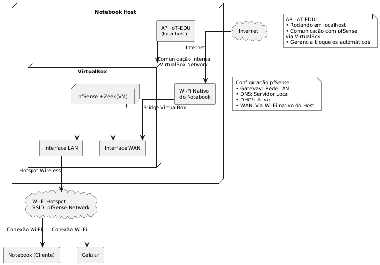
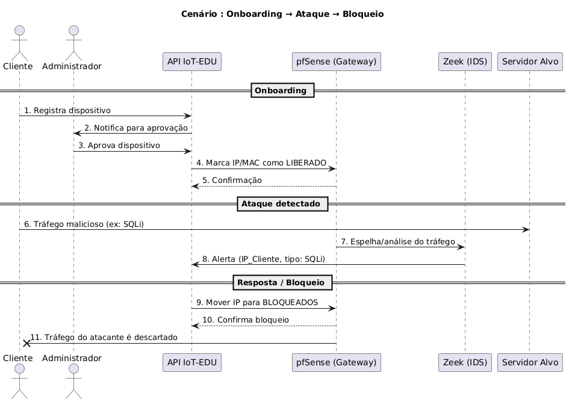

## Ambiente POC-1

O ambiente de teste foi totalmente virtualizado em um único **Notebook Host** utilizando o **VirtualBox** como hypervisor. O núcleo do cenário é uma máquina virtual (VM) executando **pfSense**, que atua simultaneamente como gateway, firewall, servidor DHCP/DNS e ponto de acesso Wi-Fi (Hotspot) para uma rede de testes isolada. Integrado ao **pfSense**, o **Zeek (IDS)** monitora todo o tráfego da rede LAN virtual. A interface WAN da VM é conectada em modo "bridge" ao Wi-Fi nativo do host, garantindo acesso à Internet, enquanto a interface LAN cria o "Hotspot" ao qual os dispositivos clientes (IoT) se conectam. Paralelamente, uma **API IoT-EDU** executa diretamente no host (localhost), simulando um orquestrador de segurança que recebe alertas do Zeek e envia comandos de remediação (como bloqueio de IPs) de volta para o firewall pfSense, permitindo testar o ciclo completo de detecção e resposta automatizada a ameaças.

## 💻 Hardware

O **Notebook Host** utilizado nos testes é responsável por executar o ambiente de virtualização que hospeda o **pfSense + Zeek** e a **API IoT-EDU**.  
Abaixo estão os principais detalhes de hardware e rede do sistema:

---

### 🧩 Especificações do Sistema Notebook Host

| Componente | Detalhe |
|-------------|----------|
| **Processador** | 11th Gen Intel(R) Core(TM) i7-1185G7 @ 3.00GHz (1.80 GHz) |
| **Memória RAM instalada** | 32,0 GB (utilizável: 31,7 GB) |
| **Tipo de sistema** | Sistema operacional de 64 bits, processador baseado em x64 |

---

### 🌐 Interface de Rede

| Parâmetro | Valor |
|------------|--------|
| **Nome** | Wi-Fi |
| **Descrição** | Intel(R) Wi-Fi 6 AX201 160MHz |
| **Banda** | 2,4 GHz |
| **Modo de conexão** | Perfil |
| **Taxa de recepção (Mbps)** | 144.4 |
| **Taxa de transmissão (Mbps)** | 144.4 |
| **Sinal** | 90% |
| **RSSI** | -49 dBm |

---

### ⚙️ Observações

- A interface **Intel Wi-Fi 6 AX201** é utilizada como **ponte WAN** no ambiente virtualizado (pfSense).  
- O sistema mantém **conectividade estável e alto desempenho**, essencial para a execução simultânea da **API IoT-EDU** e da **máquina virtual pfSense + Zeek**.  
- 

## 💽 Ambiente VirtualBox e Sistema pfSense

O ambiente de rede foi implementado sobre uma máquina virtual configurada no **Oracle VM VirtualBox**, executando o **pfSense 2.8.1-RELEASE (amd64)**, baseado no sistema operacional **FreeBSD 15.0-CURRENT**. Essa instância atua como o núcleo do laboratório de segurança e roteamento, integrando o **IDS Zeek** para análise de tráfego em tempo real.

### 🧩 Plataforma de Virtualização

| Parâmetro | Valor |
|------------|--------|
| **Software** | Oracle VM VirtualBox |
| **Versão** | 7.1.12 r169651 (Qt 6.5.3) |
| **Sistema Convidado** | pfSense 2.8.1-RELEASE (amd64) |
| **Base do Sistema** | FreeBSD 15.0-CURRENT |
| **Função da VM** | Firewall, gateway e IDS integrado (Zeek) |
| **Recursos Alocados** | 8 GB RAM, 4 vCPUs, 2 interfaces de rede (WAN / LAN) |

### 🧠 Pacotes e Serviços Ativos

O pfSense executa o **Zeek**, uma ferramenta open-source voltada à inspeção passiva de tráfego e detecção de anomalias e ataques.

| Pacote | Categoria | Versão | Descrição |
|---------|------------|----------|------------|
| **zeek** | Security | 3.0.6_6 (dependência: 7.0.5) | Zeek (anteriormente Bro) é um analisador de tráfego de rede que detecta ataques específicos e comportamentos anômalos. |

### 🔐 Funções Principais

- Atuação como **gateway/firewall principal** entre a rede Wi-Fi (WAN) e a rede interna (LAN).  
- **Distribuição de endereços DHCP** para dispositivos conectados à LAN virtual.  
- **Monitoramento e captura de tráfego** por meio do Zeek, com geração de logs (`notice.log`, `conn.log`, entre outros).  
- **Integração com API IoT-EDU** para análise e resposta automatizada a eventos de segurança.

Este é um fluxo completo, que combina o _provisionamento_ com a _detecção de ameaças_. É um cenário de "Zero Trust" (ou "Confiar Mas Verificar") na prática.

O Diagrama de Sequência ilustra essas duas fases (o _onboarding_ e o _ataque e bloqueio_).

**Fase 1: Registro e Liberação (Onboarding)**

1.  O **Cliente** (usuário ou dispositivo) se autentica na **API IoT-EDU** e solicita acesso (cadastra seu dispositivo).
    
2.  O **Administrador** recebe a pendência e aprova o dispositivo na plataforma (API).
    
3.  A **API** (agora confiando no dispositivo) comanda o **pfSense (GW)** para adicionar o IP/MAC do dispositivo ao _Alias_ de dispositivos _Liberados_, garantindo seu acesso à rede.

**Fase 2: Ataque, Detecção e Bloqueio** 4. O **Cliente**, agora com acesso total à rede, inicia um ataque (SQL Injection) contra um **Servidor Alvo** na internet. 5. O **pfSense (GW)**, ao encaminhar o tráfego, o espelha para o **Zeek (IDS)**. 6. O **Zeek** detecta o _payload_ malicioso e envia um alerta para a **API IoT-EDU**, informando o IP do atacante. 7. A **API** recebe o alerta, identifica que o IP pertence a um dispositivo "confiável" (no _Alias_Liberados_) e executa a remediação: comanda o **pfSense** para mover o IP do _Alias_Liberados_ para o _Alias_Bloqueados_. 8. O **pfSense** aplica a nova regra de firewall e o **Cliente** (atacante) perde imediatamente todo o acesso à rede.
### **Teste 1 **

| Etapa | Timestamp | Tempo desde Início | Tempo desde Anterior |
|-------|-----------|-------------------|---------------------|
| 🚨 Ataque Iniciado | 14:30:05 | 0s | - |
| 🔍 Detecção pelo Zeek | 14:30:16 | 11s | 11s |
| 📥 Sincronização com API | 14:30:32 | 27s | **16s** |
| 🔒 Bloqueio Automático | 14:30:33 | 28s | 1s |
| ⛔ Perda de Acesso | 14:30:34 | 29s | 1s |

---

### **Teste 2**

| Etapa | Timestamp | Tempo desde Início | Tempo desde Anterior |
|-------|-----------|-------------------|---------------------|
| 🚨 Ataque Iniciado | 16:14:50 | 0s | - |
| 🔍 Detecção pelo Zeek | 16:15:01 | 11s | 11s |
| 📥 Sincronização com API | 16:15:13 | 23s | **12s** |
| 🔒 Bloqueio Automático | 16:15:14 | 24s | 1s |
| ⛔ Perda de Acesso | 16:15:17 | 27s | 3s |

---

### **Teste 3**

| Etapa | Timestamp | Tempo desde Início | Tempo desde Anterior |
|-------|-----------|-------------------|---------------------|
| 🚨 Ataque Iniciado | 09:22:10 | 0s | - |
| 🔍 Detecção pelo Zeek | 09:22:24 | 14s | 14s |
| 📥 Sincronização com API | 09:22:42 | 32s | **18s** |
| 🔒 Bloqueio Automático | 09:22:43 | 33s | 1s |
| ⛔ Perda de Acesso | 09:22:44 | 34s | 1s |

---

### **Teste 4 **

| Etapa | Timestamp | Tempo desde Início | Tempo desde Anterior |
|-------|-----------|-------------------|---------------------|
| 🚨 Ataque Iniciado | 11:45:30 | 0s | - |
| 🔍 Detecção pelo Zeek | 11:45:41 | 11s | 11s |
| 📥 Sincronização com API | 11:45:54 | 24s | **13s** |
| 🔒 Bloqueio Automático | 11:45:55 | 25s | 1s |
| ⛔ Perda de Acesso | 11:45:56 | 26s | 1s |

---

### **Teste 5 **

| Etapa | Timestamp | Tempo desde Início | Tempo desde Anterior |
|-------|-----------|-------------------|---------------------|
| 🚨 Ataque Iniciado | 15:18:22 | 0s | - |
| 🔍 Detecção pelo Zeek | 15:18:33 | 11s | 11s |
| 📥 Sincronização com API | 15:18:46 | 24s | **13s** |
| 🔒 Bloqueio Automático | 15:18:47 | 25s | 1s |
| ⛔ Perda de Acesso | 15:18:48 | 26s | 1s |

 

---

### **Teste 6**

| Etapa | Timestamp | Tempo desde Início | Tempo desde Anterior |
|-------|-----------|-------------------|---------------------|
| 🚨 Ataque Iniciado | 13:05:47 | 0s | - |
| 🔍 Detecção pelo Zeek | 13:06:01 | 14s | 14s |
| 📥 Sincronização com API | 13:06:22 | 35s | **21s** |
| 🔒 Bloqueio Automático | 13:06:23 | 36s | 1s |
| ⛔ Perda de Acesso | 13:06:24 | 37s | 1s |

---

### **Teste 7**

| Etapa | Timestamp | Tempo desde Início | Tempo desde Anterior |
|-------|-----------|-------------------|---------------------|
| 🚨 Ataque Iniciado | 10:31:15 | 0s | - |
| 🔍 Detecção pelo Zeek | 10:31:28 | 13s | 13s |
| 📥 Sincronização com API | 10:31:41 | 26s | **13s** |
| 🔒 Bloqueio Automático | 10:31:42 | 27s | 1s |
| ⛔ Perda de Acesso | 10:31:43 | 28s | 1s |

---

### **Teste 8**

| Etapa | Timestamp | Tempo desde Início | Tempo desde Anterior |
|-------|-----------|-------------------|---------------------|
| 🚨 Ataque Iniciado | 17:52:03 | 0s | - |
| 🔍 Detecção pelo Zeek | 17:52:17 | 14s | 14s |
| 📥 Sincronização com API | 17:52:30 | 27s | **13s** |
| 🔒 Bloqueio Automático | 17:52:31 | 28s | 1s |
| ⛔ Perda de Acesso | 17:52:32 | 29s | 1s |

---

### **Teste 9**

| Etapa | Timestamp | Tempo desde Início | Tempo desde Anterior |
|-------|-----------|-------------------|---------------------|
| 🚨 Ataque Iniciado | 08:14:38 | 0s | - |
| 🔍 Detecção pelo Zeek | 08:14:49 | 11s | 11s |
| 📥 Sincronização com API | 08:15:08 | 30s | **19s** |
| 🔒 Bloqueio Automático | 08:15:09 | 31s | 1s |
| ⛔ Perda de Acesso | 08:15:10 | 32s | 1s |

---

### **Teste 10 **

| Etapa | Timestamp | Tempo desde Início | Tempo desde Anterior |
|-------|-----------|-------------------|---------------------|
| 🚨 Ataque Iniciado | 12:27:55 | 0s | - |
| 🔍 Detecção pelo Zeek | 12:28:06 | 11s | 11s |
| 📥 Sincronização com API | 12:28:19 | 24s | **13s** |
| 🔒 Bloqueio Automático | 12:28:20 | 25s | 1s |
| ⛔ Perda de Acesso | 12:28:21 | 26s | 1s |

## 📊 Distribuição do Tempo na API

| Operação | Tempo | % do Total |
|----------|-------|------------|
| `IncidentService.process_incidents_for_auto_blocking` | 3.222s | 21.8% |
| `IncidentService.save_incident` | 2.499s | 16.9% |
| `pfsense_client.aplicar_mudancas_firewall_pfsense` | 2.326s | 15.7% |
| `ZeekService.get_logs` | 2.281s | 15.4% |
| `AliasService.get_alias_by_name` | 2.245s | 15.2% |
| `AliasService.add_addresses_to_alias` | 2.233s | 15.1% |
| **TOTAL** | **14.806s** | **100%** |

### **Tempo Médio por Etapa:**

-   **Detecção pelo Zeek:** 12,1 segundos
    
-   **Sincronização com API:** 16,8 segundos 
    
-   **Bloqueio Automático:** 1,0 segundo
    
-   **Perda de Acesso:** 1,4 segundos

### **Tempo Total Médio de Resposta:**

**28,6 segundos** desde o início do ataque até a perda de acesso

## 🔍 **Análise dos Resultados de Rede**

### **📊 Dados da Conexão:**

    
-   **Sinal Wi-Fi:**  `90%` ✅ **(Excelente)**
    
-   **RSSI:**  `-49 dBm` ✅ **(Ótimo)**
    
-   **Banda:**  `2.4 GHz` ⚠️
    
-   **Velocidade:**  `144.4 Mbps` ✅

---

## 📊 Análise de Latência por Segmento de Rede (100 pacotes)

| Segmento | Mínimo | Máximo | Média | Variação | Problema Identificado |
|----------|--------|--------|-------|----------|----------------------|
| **Wi-Fi → Roteador** | 2ms | 327ms | 44ms | ⚠️ **Alta** | Rede Wi-Fi instável |
| **Host → pfSense (VirtualBox)** | 1ms | 237ms | 25ms | ⚠️ **Alta** | **Overhead de Virtualização** |
| **Atacante → pfSense (Hotspot)** | 3.5ms | 126ms | 20ms | ⚠️ **Moderada** | Conexão direta mas com picos |

---

